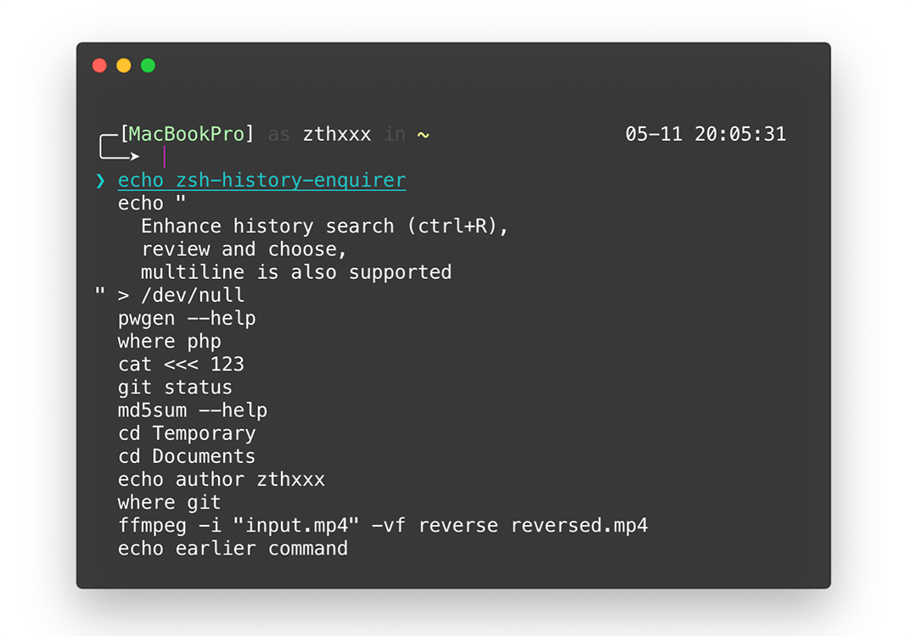

<h1 align="center">zsh-history-enquirer</h1>

<p align="center">
  <a href="https://travis-ci.org/zthxxx/zsh-history-enquirer" target="_blank" rel="noopener noreferrer"></a>
  <a href="https://www.npmjs.com/package/zsh-history-enquirer" target="_blank" rel="noopener noreferrer"></a>
  <a href="https://www.npmjs.com/package/zsh-history-enquirer" target="_blank" rel="noopener noreferrer"></a>
  <a href="https://nodejs.org/" target="_blank" rel="noopener noreferrer"></a>
  <a href="https://github.com/zthxxx/zsh-history-enquirer/blob/master/LICENSE" target="_blank" rel="noopener noreferrer"></a>
</p>


## What's this

a plugin for **enhance zsh history search interaction**, review and choose in multilines


## Preview

### screenshot

<p align="center">
  <kbd>Ctrl</kbd> + <kbd>R</kbd>
  <br />
  
</p>

### live demo

<p align="center">
  
</p>

## Install

### oh-my-zsh

if you used [`oh-my-zsh`](https://github.com/robbyrussell/oh-my-zsh), **all you need to do is the one command for npm**

```bash
npm i -g zsh-history-enquirer
```

the install/uninstall hooks will be correct in setup `oh-my-zsh` plugins and config, so manual edit `.zshrc` is also **no longer necessary**

### root

but for **root**, must enable option `--unsafe-perm`

```bash
# https://stackoverflow.com/questions/49084929/npm-sudo-global-installation-unsafe-perm
npm i -g zsh-history-enquirer --unsafe-perm
```

### one-line command

or one-line command (which will install node via nvm)

```bash
curl -#sSL https://github.com/zthxxx/zsh-history-enquirer/raw/master/installer.zsh | zsh
```

### manually without oh-my-zsh

if you dont have `oh-my-zsh`, manual add `source` plugin file to `.zshrc` after npm installed

and manual remove the `source` command while uninstalled

```bash
echo 'source `npm root -g`/zsh-history-enquirer/zsh-history-enquirer.plugin.zsh' >> ~/.zshrc
```


## Usage

this plugin will replace default zsh history search as shortcuts `^R`

just press <kbd>^R</kbd> (<kbd>Ctrl</kbd> + <kbd>R</kbd>) for enjoy it!


## License

[MIT LICENSE](./LICENSE)


## Author

**zsh-history-enquirer** © [zthxxx](https://github.com/zthxxx), Released under the **[MIT](./LICENSE)** License.<br>

> Blog [@zthxxx](https://blog.zthxxx.me) · GitHub [@zthxxx](https://github.com/zthxxx)

